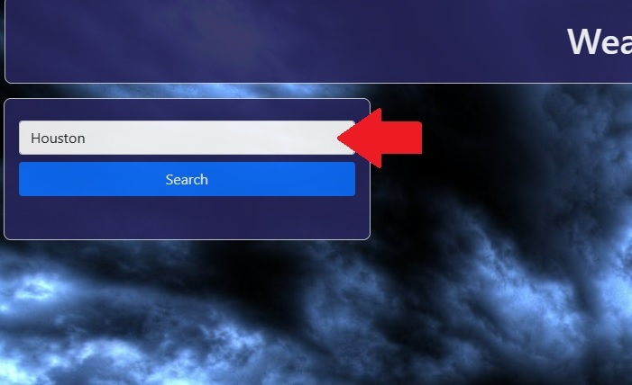
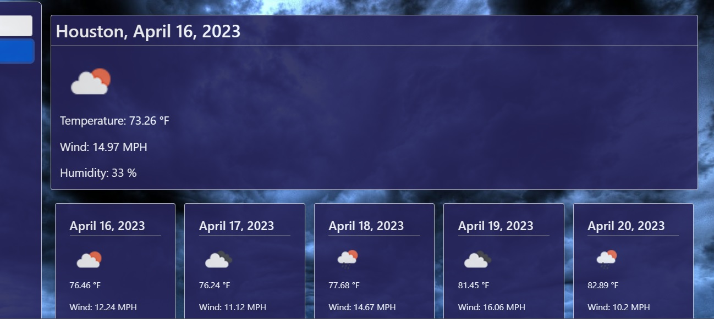
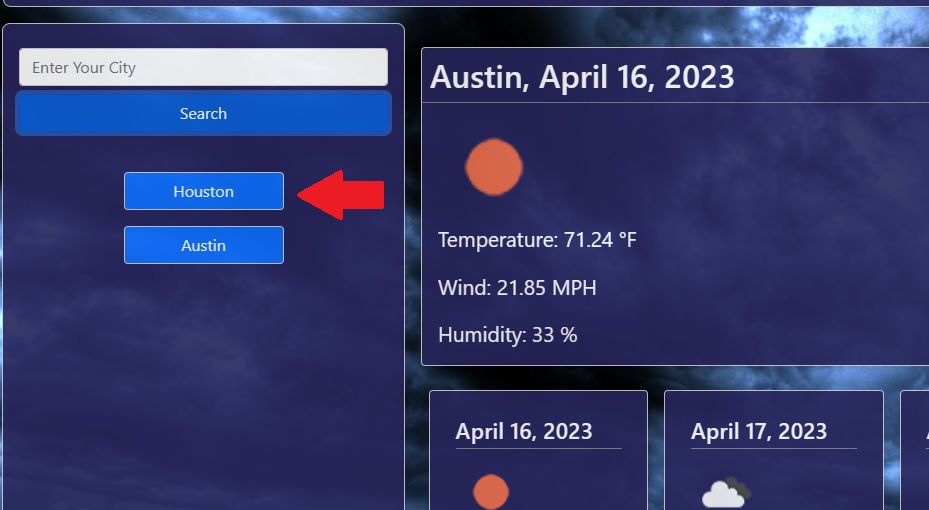

# Module 6 Weather API Project

I this project I created a simple weather app from scratch that talks to the OpenWeather API and displays current and future weather conditions for the searched city.

## Installation

N/A
    
## Usage/Examples

[https://bradfh.github.io/Brads-Weather-App](https://bradfh.github.io/Brads-Weather-App)

When you load the page you will be presented with this screen 

Select the search bar and type the name of the city you would like to get weather conditions for.  If you enter an invalid city name the console will tell you that the input was invalid.

You be presented with the current weather conditions for your city and a 5 "day" forecast.  Due to the way the API returned the forecast data it was difficult to guarantee that each forecast entry was a future date.

Once you enter a valid search the search will be saved to local storage and then will populate the area beneath the search bar with a button that when clicked will execute the search for that city again.  It will save up to 6 previous searches.

## Lessons Learned

The biggest lesson learned on this project was to use console.log to diagnose problems.  There were many times that I was getting errors that I didnt understand, but when I would log the thing in question most of the time the problem was illuminated.  

I learned various other small things.  For example if I am trying to create a variable that is made up of other variables, like a URL for example, I need to use backticks instead of quotes.  

I learned thanks to google how to format and display dates and times inside the JS when I received those dates in unix.

I learned that hard coding certain Elements that I needed to fill with API data was easy, even though it makes my code wetter (probabaly).

I got practice with calling functions with parameters.

## License

[MIT](https://choosealicense.com/licenses/mit/)

## Screenshots

